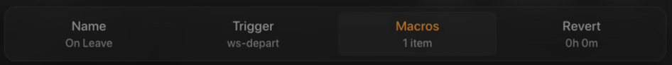

# Journal Entry 01

## I. Overview

I have a series of 15" touchscreens I use to control most of my home.
The interfaces and the controller are all of my own design and have evolved over many years.

The program is called [UDAP](https://github.com/bradenn/udap) (Universal Device Aggregation Platform).

There are nearly one hundred unique interfaces throughout the system, the module I will be focusing on in this journal
is the subroutine system.
The subroutine system lets you change smart device states, run programs, execute scripts, or call any functions in a go
plugin.
The system allows you to connect an event with an action, almost like apple's shortcuts.

I made the subroutine interface quite a while ago, and it has some behaviors I haven't had the agency to fix. I will be
walking through the steps to create a subroutine that turns off all the lights when I leave the house.

The following image is the `Settings -> Subroutines` page.
A precursor to creating a subroutine is creating a trigger (what causes the subroutine to be activated) and a macro (a
set of instructions to apply to a group of devices within a zone).

## II. Subroutine Creation

### 1. Choose a Name

After selecting the 'create subroutine' button in the toolbar, the following modal (dialog box) comes up, the subroutine
name input:

When I made this interface a while ago, I was proud of what I thought was an efficient design. Though, as people other
than myself
began to use it, I learned it wasn't as effective as I imagined.

I had envisioned bar to be an effective mode of navigation for moving between each step:

Step 1:

Step 2:

Step 3:

Step 4 (Final):

There is no limit to which order you can go to tabs, through pressing next will take you to the next tab.
The lack of directional clues makes it feel more like one of those cheesy css dropdown menus than an orderly step based
system.

### 2. Select a Trigger

The next step is selecting a trigger. Triggers can be registered and triggered by plugins, system states, or manually as
buttons.

The trigger I'll use is 'ws-depart' which is registered by the plugin 'worldspace' (WS). The worldspace plugin connects
with homekit and mirrors Apple's ecosystem triggers. In this case ws-depart is called when all occupants are no longer
within range of the Wi-Fi network.

Only one trigger can be selected, and this is apparent as attempting to click a second unselects the first selection,
like an HTML radio button. I made sure to copy this **mental model** since most people are already familiar with it.

### 3. Select a Macro

The next step of the process is selecting a macro. A macro is a composite of a zone, which is a group of devices with a
name, and a state value which will be applied to all of those devices.

The one selected here is called "Global Off", which is a system macro that allows you to set the power state of every
entity (device) to off. I would prefer if all of these macros were organized into system, user, and module (plugin)
generated sections.

### 4. Select a Revert Time

The last part of the four-stage subroutine emplacement is the optional revert stage, which is only used for very
specific use cases. Like turning off a light that was activated by a motion sensor. If no further triggers take place in
the revert time, the state of the light is returned to what it was before being triggered. This is **learnable** but not
very **memorable** as this tools is only used a few times a year.

This is an incredibly useful feature but there is no obvious way to recognize that a value of 0 will disable the revert
feature. I'm often tempted to click save after selecting a macro, which works, but leaves the subroutine incomplete.

## III. Subroutine Management

### 1. Review

Once you create the subroutine, you are taken back to the subroutine page where the only way to tell you succeeded is by
the presence of you new subroutine.

When you delete a subroutine, a notification pops up announcing the success of the operation. I would like this too for
when a subroutine is created. I can imagine an instance in which the subroutine page has many items that require
scrolling to see. It may not be immediately obvious that your new subroutine was in fact created:

Here is a screenshot of the notification when you delete a subroutine, this could easily be added to the creation
action:

### 2. Navigation

Looking at the newly created subroutine, it's easy to notice there is a lamp icon which we never had the opportunity to
select. Having an icon here is good, as it works as a **map** of the real world, but we weren't given the choice, so the
default icon can contradict the actual subroutine function:

From here there is no obvious method for changing the icon, no edit button or icon that could indicate a button.
Aimlessly touching will eventually lead you to touch the box which will take you to the subroutine management page as
seen below:

### 3. Overview

This page summarizes the subroutine configuration. We can see that the ws-depart trigger was last called three months
ago and was called by a module, presumably worldspace. I would be nice to have that specific information.

The buttons can look like the other UI elements, and it can be confusing. The only clues that a box is a button is the
icon and centered text, which is not immediately obvious to new users.

You can remove macros from this screen, or you can more comprehensively add and remove macros from the manage page
denoted by the button with a cog.

### 4. Changes

This page is very similar to the subroutine creating page, which the exception to the added icon tab. There is no reason
why the creation page couldn't also have the icon tab.

## Conclusion

This interface was experimental at the time I made it and I never got around to clipping the loose threads. Moving
through the UI is simple enough, but its no easy task. Any unfamiliar user will have no idea what a zone, macro, or
trigger is.

Another issue is how strictly linear the interface is. If you decide you need to create a zone or macro while creating a
subroutine, you have to cancel and go do that first. And you'll have to endure those interfaces too, which are very
similar to this one. A better approach would be to walk the user through the options and to get their desired
configuration, then automatically generating those components as needed.